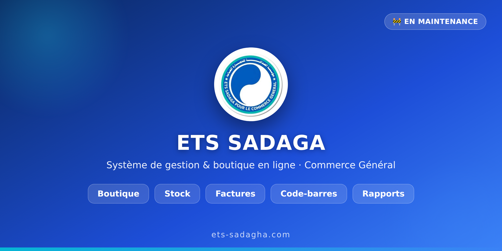

# مؤسسة الصداقة للتجارة العامة — نظام الإدارة والمتجر

> 🚧 **قيد الصيانة والتطوير** — لم يُنشر بعد للعموم.

نظام متكامل يعمل في المتصفح (كمبيوتر/هاتف) يجمع بين:

- 🛒 **واجهة متجر** للزبائن (أقسام، منتجات بصور، سلة، طلب عبر واتساب).
- 📊 **لوحة إدارة** للمدير: لوحة تحكم، منتجات، مخزون وجرد، فواتير بيع وشراء، عملاء وموردون، مصروفات، صندوق، وتقارير.
- 🏷️ **باركود** (Code128): توليد، طباعة ملصقات، ومسح بالكاميرا.
- 🤖 **بحث بالصورة** (ذكاء اصطناعي): تصوير منتج لإيجاد الأقرب شبهاً (يتطلب إنترنت لتحميل النموذج).
- 💾 **حفظ محلي** تلقائي مع نسخ احتياطي (تصدير/استعادة) واستيراد منتجات من Excel/CSV.

التطبيق ملف واحد (`index.html`) بدون أي اعتماديات خارجية ويعمل دون إنترنت.

---

## التشغيل

افتح ملف `index.html` في أي متصفح حديث.

- **الواجهة الأمامية:** تظهر للزبائن مباشرةً.
- **دخول المدير:** اضغط **حساب** في الشريط السفلي، وكلمة المرور الافتراضية: `admin` (تُغيَّر من الإعدادات).

> ملاحظة: حفظ البيانات والكاميرا يعملان بشكل كامل بعد فتح الملف من جهازك أو بعد النشر عبر رابط آمن (https).

---

## النشر لاحقاً (عند الجاهزية)

عبر **GitHub Pages**: من إعدادات المستودع › Pages › اختر الفرع `main` والمجلد `/root`. سيصبح الموقع متاحاً على رابط عام.

---

## خارطة التطوير

- [ ] إدخال الأقسام والمنتجات الحقيقية
- [ ] مزامنة سحابية بين الأجهزة + دخول الموظفين بالصلاحيات
- [ ] الترجمة الفرنسية
- [ ] النشر النهائي

---

© مؤسسة الصداقة للتجارة العامة — ETS SADAGA POUR LE COMMERCE GENERAL.
